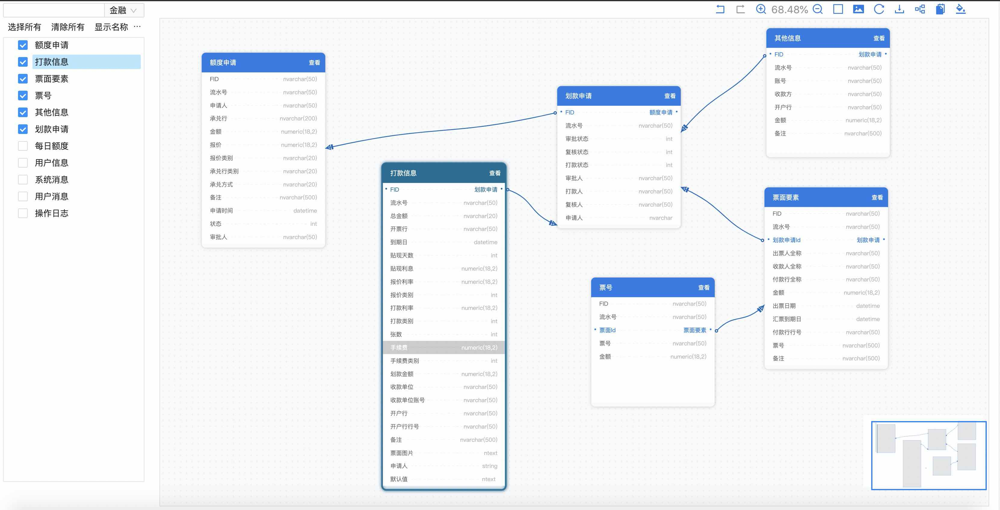

# web-pdm

English | [简体中文](./README.zh-CN.md)


A lightweight, embeddable ER diagram workspace for React, powered by G6 5. The
project started as **an ER graph tool made with G6**, with the long-term goal of
building an online PowerDesigner that works on every modern platform.



## Project origin

The design ideas and the early implementation story are recorded in
[Design and implementation of an ER diagram](https://www.yuque.com/antv/g6-blog/nbaywp).
The original motivation remains unchanged: teams need a visual surface that can
describe business models, relational schemas and domain boundaries without
being tied to a Windows-only desktop tool.

## Online experience

- [Documentation and interactive workspace](https://erd.zyking.xyz/)
- [Complete model demo](https://erd.zyking.xyz/demo/)
- [Historical model demo](https://erd.zyking.xyz/~demos/docs-erd 'Model')

## Highlights

- Real G6 `5.1.1` rendering, relation layouts, minimap and PNG export
- Source-owned lightweight controls with Radix primitives and Lucide icons
- No Ant Design, dumi, father or Docker runtime dependency
- English by default, with complete Simplified Chinese support
- Light and dark themes with readable canvas, controls and overlays
- Responsive full-viewport workspace; empty navigation panels stay hidden
- Static documentation output ready for Cloudflare Workers

## Requirements

- Node.js `22.13.0` or newer
- pnpm `11.12.0`

## Local development

```bash
corepack enable
pnpm install
pnpm dev
```

The development server prints the local documentation URL. The home page contains the interactive ER workspace.

The original development flow used the equivalent commands below. They remain
documented for contributors coming from earlier versions:

```bash
npm i
npm run dev
```

## Verification

```bash
pnpm test
pnpm typecheck
pnpm lint
pnpm build
pnpm test:browser
pnpm test:exports
```

## Packages

- `web-pdm`: ready-to-use React component with lightweight controls and icons
- `web-pdm-core`: framework-neutral core component and public types

## Contributing

Issues, pull requests and product feedback are welcome. The project has always
been built with its users; the community QR code retained from the original
documentation is shown below.


## Sponsor

If web-pdm helps your work, you can support its continued maintenance through
the original sponsorship channel.


## Change log

The historical roadmap and version notes are preserved in
[历史资料](./doc/历史资料.md). Current releases and migration boundaries are
documented on the website and in the repository history.

## Deployment

See [部署到 Cloudflare](./部署到Cloudflare.md). The site is built with
`pnpm build:site` and published from `docs-dist` as Worker static assets; Docker
is not required.

## License

[MIT](./LICENSE)
