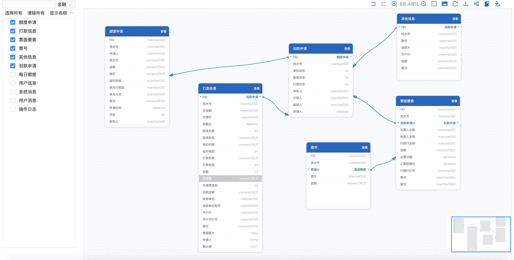

# 介绍

web-pdm 是一个用 G6 制作的 ER 图工具，最终目标是做成在线版 PowerDesigner。



## 缘起

[《ER 图的设计与实现》](https://www.yuque.com/antv/g6-blog/nbaywp)记录了项目最初的设计思路。

## 在线体验

原文档提供了两个早期环境：

- [定制版 Demo](http://zyking.xyz:5080/demo/ '定制版 Demo')
- [基本版 Demo](http://zyking.xyz:5002/ '基本版 Demo')

这些历史地址可能已经停止服务，保留在此用于追溯。当前入口是 [erd.zyking.xyz](https://erd.zyking.xyz/)。

## 快速启动

```bash
npm i
npm run watch
```

> **历史实现说明**：`npm run watch` 属于早期构建链路。当前仓库使用 pnpm 和 Rspress，开发命令为 `pnpm dev`。

## 特性与版本记录

### next

- [ ] 模型在线新增和编辑
- [ ] 导出 SQL 语句

以上两项是原始产品路线图，继续作为后续方向保留。

### 0.0.3

- [x] Ant Design 从 V3 升级到 V4
- [x] 美化布局样式
- [x] 将 `.PDM` 文件上传按钮调整到工具栏

### 0.0.2

- [x] 状态管理从 DVA 迁移到轻量级的 `unstated-next`

### 0.0.1

- [x] 以 TypeScript 源码形式发布 npm 包
- [x] 使用 DVA 管理状态
- [x] 支持上传 `.PDM` 文件

## 当前架构说明

当前版本已经升级到 G6 5，并以 `web-pdm` 和 `web-pdm-core` 两个包分别提供开箱即用的轻量界面与核心能力。默认界面不再依赖 Ant Design，文档构建也不再依赖 dumi/father；公开模型数据和事件接口则尽量延续旧版用法。

更完整的历史说明见[《历史资料》](./历史资料.md)。

## 感谢

- [AntV G6](https://g6.antv.antgroup.com/)
- DVA：[历史文档](https://dvajs.com/guide/)（当前可能无法访问）与[源码仓库](https://github.com/dvajs/dva)
- [pdm-to-json](https://github.com/shermam/pdm-to-json)

DVA 和旧版 G6 API 属于历史技术选型，仍在这里完整保留致谢。当前实现以 G6 5 和仓库公开类型为准。
